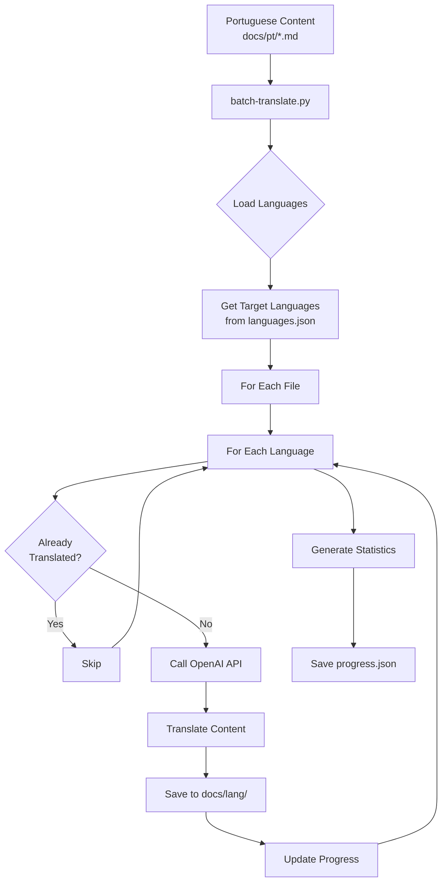

# Implementation Summary: Multilingual Translation System

## 🎯 What Was Implemented

A complete batch translation system to translate Portuguese content to **158+ enabled languages** using OpenAI-compatible APIs.

## 📦 New Files Created

### 1. Core Translation Scripts

#### `scripts/batch-translate.py` (388 lines)
**Main batch translation engine**
- Translates all Portuguese `.md` files to all enabled languages
- Progress tracking with resume capability
- Error handling and detailed statistics
- Supports dry-run mode
- Command-line interface with multiple options

**Features:**
- ✅ Automatic translation of 15 Portuguese markdown files
- ✅ Support for 158+ target languages
- ✅ Progress saved to `progress.json`
- ✅ Resume interrupted translations
- ✅ Detailed statistics and error reporting
- ✅ Rate limiting to avoid API throttling
- ✅ Preserves markdown formatting and frontmatter

**Usage:**
```bash
# Translate to all enabled languages
python3 scripts/batch-translate.py

# Translate to specific languages
python3 scripts/batch-translate.py --languages en,es,fr,de

# Dry run (preview)
python3 scripts/batch-translate.py --dry-run

# Resume from previous run
python3 scripts/batch-translate.py --resume
```

#### `scripts/batch-translate.sh` (117 lines)
**User-friendly shell wrapper**
- Colored output and progress display
- Environment validation
- Preset translation strategies
- Help and usage instructions

**Features:**
- ✅ Checks for OPENAI_API_KEY
- ✅ Displays configuration before running
- ✅ Preset options (--popular, --languages)
- ✅ Beautiful formatted output

**Usage:**
```bash
# Translate to popular languages
./scripts/batch-translate.sh --popular

# Translate to specific languages
./scripts/batch-translate.sh --languages en,es,fr

# Show help
./scripts/batch-translate.sh --help
```

#### `scripts/test-translation-setup.py` (136 lines)
**Setup validation tool**
- Verifies all requirements are met
- Tests file structure
- Checks API configuration
- Estimates translation scope and cost

**Features:**
- ✅ Validates languages.json
- ✅ Checks Portuguese content
- ✅ Verifies scripts exist
- ✅ Tests API configuration
- ✅ Estimates costs

### 2. Documentation

#### `TRANSLATION_GUIDE.md` (324 lines)
**Complete translation documentation**
- Quick start guide
- Detailed usage instructions
- Cost estimations
- Troubleshooting guide
- Configuration options
- Best practices

**Sections:**
- 📋 Overview
- 🚀 Quick Start
- 📊 Progress Tracking
- 🛠️ Advanced Usage
- 💰 Cost Estimation
- 🔧 Configuration
- 🐛 Troubleshooting
- 📝 How It Works
- 🎯 Best Practices

#### `QUICK_START.md` (89 lines)
**Fast reference guide**
- One-page quick reference
- Essential commands
- Translation strategies
- Cost summary
- Language lists

**Perfect for:**
- New users getting started
- Quick command reference
- Understanding options

#### `IMPLEMENTATION_SUMMARY.md` (this file)
**Implementation details**
- What was created
- How it works
- File structure
- Usage examples

### 3. Enhanced Existing Files

#### `README.md`
**Updated with:**
- 🌍 New translation section
- 📊 Translation options table
- 🚀 Quick start commands
- 💰 Cost estimates
- 📖 Links to new documentation

## 🔧 How the System Works

### Translation Flow



### Key Components

1. **Source Detection**: Finds all `.md` files in `docs/pt/`
2. **Language Loading**: Reads enabled languages from `languages.json`
3. **Translation Loop**: For each file × each language
4. **API Call**: Sends content to OpenAI for translation
5. **Format Preservation**: Maintains markdown structure
6. **Progress Tracking**: Records completed/failed translations
7. **Resume Support**: Skips already-completed work

### File Structure After Translation

```
docs/
├── pt/                          # Source (15 files)
│   ├── index.md
│   ├── blog/
│   │   ├── pibic-dream.md
│   │   ├── fapesp-path.md
│   │   ├── mestrado-vision.md
│   │   └── index.md
│   ├── enem2026/
│   │   ├── week-01.md
│   │   ├── week-02.md
│   │   └── index.md
│   ├── neuroscience/
│   │   ├── coursera-computational-neuroscience.md
│   │   ├── neuromatch-notes.md
│   │   ├── open-source-projects.md
│   │   └── index.md
│   └── templates/
│       ├── weekly-template.md
│       ├── monthly-summary.md
│       └── research-log.md
│
├── en/                          # English (15 files)
│   └── [same structure]
│
├── es/                          # Spanish (15 files)
│   └── [same structure]
│
├── fr/                          # French (15 files)
│   └── [same structure]
│
└── [155+ other languages]
    └── [same structure]
```

## 📊 Translation Scope

### Content to Translate

| Category | Files | Description |
|----------|-------|-------------|
| Homepage | 1 | Main landing page |
| Blog | 4 | Personal reflections and academic journey |
| ENEM 2026 | 3 | Weekly study logs |
| Neuroscience | 4 | Course notes and research |
| Templates | 3 | Markdown templates |
| **Total** | **15** | **All Portuguese content** |

### Target Languages

| Strategy | Languages | Files × Langs | API Calls | Est. Cost |
|----------|-----------|---------------|-----------|-----------|
| Top 5 | 5 | 15 × 5 | 75 | $0.25-$0.50 |
| Popular | 10 | 15 × 10 | 150 | $0.50-$1.00 |
| All Enabled | 158+ | 15 × 158 | 2,370 | $5.00-$10.00 |

**Popular Languages (--popular):**
- 🇺🇸 English (en)
- 🇪🇸 Spanish (es)
- 🇫🇷 French (fr)
- 🇩🇪 German (de)
- 🇮🇹 Italian (it)
- 🇯🇵 Japanese (ja)
- 🇨🇳 Chinese (zh)
- 🇷🇺 Russian (ru)
- 🇸🇦 Arabic (ar)
- 🇮🇳 Hindi (hi)

## 🚀 Getting Started

### Step 1: Set API Key

```bash
export OPENAI_API_KEY='sk-your-api-key-here'
```

### Step 2: Test Setup

```bash
python3 scripts/test-translation-setup.py
```

### Step 3: Preview Translation

```bash
./scripts/batch-translate.sh --dry-run
```

### Step 4: Translate to Popular Languages

```bash
./scripts/batch-translate.sh --popular
```

**This will:**
- ✅ Translate 15 files to 10 languages
- ✅ Make ~150 API calls
- ✅ Cost ~$0.50-$1.00
- ✅ Take ~5-10 minutes
- ✅ Save progress to `progress.json`

### Step 5: Check Results

```bash
# Check progress
cat progress.json

# View translated file
cat docs/en/index.md

# Check statistics
grep -A 10 "stats" progress.json
```

## 💡 Key Features

### 1. Progress Tracking

Every translation is tracked in `progress.json`:

```json
{
  "completed": [
    "index.md:en",
    "index.md:es",
    "blog/pibic-dream.md:en"
  ],
  "failed": [],
  "stats": {
    "total_files": 15,
    "total_languages": 10,
    "translations_completed": 45,
    "translations_failed": 0,
    "translations_skipped": 10
  }
}
```

### 2. Resume Capability

If interrupted, resume with:

```bash
./scripts/batch-translate.sh --resume
```

Only incomplete translations will be processed.

### 3. Smart Skipping

The system automatically skips:
- Already translated files
- Files without "[Translation needed]" marker
- Completed translations in progress.json

### 4. Error Handling

Failed translations are logged with:
- File path
- Target language
- Error message
- Timestamp

### 5. Cost Control

Multiple strategies to control costs:
- `--popular`: Translate to 10 popular languages
- `--languages X,Y,Z`: Specific languages only
- `--dry-run`: Preview without API calls

## 🎯 Usage Examples

### Example 1: Start Small (Recommended)

```bash
# Translate to just English first
./scripts/batch-translate.sh --languages en

# Check the results
ls -la docs/en/
cat docs/en/index.md

# If good, expand to more languages
./scripts/batch-translate.sh --languages es,fr,de
```

### Example 2: Popular Languages

```bash
# Translate to top 10 languages
./scripts/batch-translate.sh --popular

# Monitor progress
tail -f progress.json
```

### Example 3: All Languages

```bash
# Preview first
./scripts/batch-translate.sh --dry-run

# Then translate all
./scripts/batch-translate.sh

# This will take 30-60 minutes and cost ~$5-10
```

### Example 4: Resume After Interruption

```bash
# Start translation
./scripts/batch-translate.sh --popular

# If interrupted (Ctrl+C), resume with:
./scripts/batch-translate.sh --resume
```

## 📁 File Locations

```
/scripts/
├── batch-translate.py          # Main translation engine
├── batch-translate.sh          # Shell wrapper
├── test-translation-setup.py   # Setup validator
├── translate-content.py        # Single-file translator (existing)
├── enable-all-languages.py     # Language enabler (existing)
└── generate-all-languages.py   # Folder generator (existing)

/
├── QUICK_START.md              # Quick reference
├── TRANSLATION_GUIDE.md        # Complete guide
├── IMPLEMENTATION_SUMMARY.md   # This file
├── languages.json              # Language configuration
├── progress.json               # Translation progress (generated)
└── README.md                   # Updated with translation info
```

## 🔒 Environment Variables

Required:
```bash
export OPENAI_API_KEY='sk-...'
```

Optional:
```bash
export OPENAI_BASE_URL='https://api.openai.com/v1'
export OPENAI_API_MODEL='gpt-4o-mini'
```

## ✅ What's Ready to Use

1. ✅ **Translation scripts** - Fully functional
2. ✅ **Shell wrappers** - User-friendly interface
3. ✅ **Documentation** - Complete guides
4. ✅ **Progress tracking** - Resume support
5. ✅ **Error handling** - Detailed logging
6. ✅ **Cost estimation** - Budget awareness
7. ✅ **Dry-run mode** - Safe testing

## 🎓 Next Steps

1. **Set your API key**: `export OPENAI_API_KEY='...'`
2. **Test setup**: `python3 scripts/test-translation-setup.py`
3. **Preview**: `./scripts/batch-translate.sh --dry-run`
4. **Translate**: `./scripts/batch-translate.sh --popular`
5. **Deploy**: Commit translated files and deploy site

## 📚 Documentation Links

- [QUICK_START.md](./QUICK_START.md) - Fast reference
- [TRANSLATION_GUIDE.md](./TRANSLATION_GUIDE.md) - Complete documentation
- [README.md](./README.md) - Project overview

---

**🎉 The multilingual translation system is ready to use!**

Just set your API key and run `./scripts/batch-translate.sh --popular` to get started.
