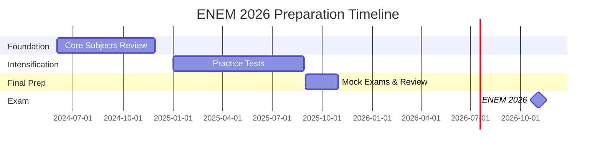

# <span class="neon-sign">📡 ENEM.MATRIX //2026 ///</span>

<div class="neon-divider"></div>

<div class="hologram" style="padding: 2rem; margin: 2rem 0;">

## 🎯 MISSION: UFABC ADMISSION VIA ENEM 2026

Systematic preparation for Brazil's national university entrance exam (ENEM). Target: **UFABC - Federal University of ABC**.

<div style="margin-top: 1.5rem;">
<span class="neon-badge">ENEM 2026</span>
<span class="neon-badge magenta">Weekly Logs</span>
<span class="neon-badge yellow">Progress Tracking</span>
<span class="neon-badge">Study Schedule</span>
</div>

</div>

---

## 📅 WEEKLY STUDY LOGS

### Current Phase: Foundation Building

<div class="glow-card" style="margin: 1.5rem 0;">

#### [Week 01 Log](week-01.md)
<span class="neon-badge yellow">COMPLETE</span>

**Focus:** Mathematics foundations, Portuguese grammar, Biology basics

**Highlights:**
- ✅ Functions and algebra review
- ✅ Text interpretation practice
- ✅ Cell biology fundamentals

</div>

<div class="glow-card" style="margin: 1.5rem 0;">

#### [Week 02 Log](week-02.md)
<span class="neon-badge yellow">COMPLETE</span>

**Focus:** Physics mechanics, History of Brazil, Chemistry atoms

**Highlights:**
- ✅ Newton's laws and kinematics
- ✅ Colonial Brazil period
- ✅ Atomic structure and periodic table

</div>

<div class="glow-card" style="margin: 1.5rem 0;">

#### [Progress Dashboard](progress.md)
<span class="neon-badge magenta">UPDATED</span>

Comprehensive view of all subjects, study hours, and performance metrics.

</div>

---

## 📊 SUBJECT BREAKDOWN

<div style="display: grid; grid-template-columns: repeat(auto-fit, minmax(300px, 1fr)); gap: 1.5rem;">

<div class="glow-card">

### 📐 Matemática e suas Tecnologias
<div class="neon-progress">
  <div class="neon-progress-bar" style="width: 85%;"></div>
</div>

**Topics:**
- Algebra & Functions
- Geometry & Trigonometry
- Statistics & Probability

**Hours/Week:** 8h  
**Current Level:** 85%

</div>

<div class="glow-card">

### 🧪 Ciências da Natureza
<div class="neon-progress">
  <div class="neon-progress-bar" style="width: 75%;"></div>
</div>

**Topics:**
- Biology (Cell, Genetics, Ecology)
- Chemistry (Atoms, Reactions)
- Physics (Mechanics, Energy)

**Hours/Week:** 10h  
**Current Level:** 75%

</div>

<div class="glow-card">

### 👥 Ciências Humanas
<div class="neon-progress">
  <div class="neon-progress-bar" style="width: 70%;"></div>
</div>

**Topics:**
- History (Brazil & World)
- Geography (Physical & Human)
- Philosophy & Sociology

**Hours/Week:** 6h  
**Current Level:** 70%

</div>

<div class="glow-card">

### 📝 Linguagens e Códigos
<div class="neon-progress">
  <div class="neon-progress-bar" style="width: 80%;"></div>
</div>

**Topics:**
- Portuguese Language
- Literature & Arts
- English Language

**Hours/Week:** 7h  
**Current Level:** 80%

</div>

</div>

---

## 📈 OVERALL PROGRESS

<div style="font-family: 'Roboto Mono', monospace; background: rgba(10, 14, 39, 0.9); padding: 2rem; border: 1px solid #00f3ff; border-radius: 8px;">

```
⚡ ENEM 2026 PREPARATION STATUS
━━━━━━━━━━━━━━━━━━━━━━━━━━━━━━━━━━━━━━━━━━━━━━━━
SUBJECT                 PROGRESS    HOURS    SCORE EST.
━━━━━━━━━━━━━━━━━━━━━━━━━━━━━━━━━━━━━━━━━━━━━━━━
Matemática              [████████░] 85%     120h     780
Ciências Natureza       [███████░░] 75%     95h      720
Ciências Humanas        [███████░░] 70%     80h      690
Linguagens              [████████░] 80%     105h     750
Redação                 [███████░░] 75%     50h      850
━━━━━━━━━━━━━━━━━━━━━━━━━━━━━━━━━━━━━━━━━━━━━━━━
TOTAL AVERAGE           [███████░░] 77%     450h     758
━━━━━━━━━━━━━━━━━━━━━━━━━━━━━━━━━━━━━━━━━━━━━━━━
TARGET SCORE: 750+
UFABC CUT-OFF: ~720 (Bacharelado em Ciência e Tecnologia)
━━━━━━━━━━━━━━━━━━━━━━━━━━━━━━━━━━━━━━━━━━━━━━━━
EXAM DATE: November 2026
DAYS REMAINING: ~620 days
━━━━━━━━━━━━━━━━━━━━━━━━━━━━━━━━━━━━━━━━━━━━━━━━
```

</div>

---

## 📝 REDAÇÃO (Essay Writing)

<div class="glow-card">

### Current Focus: Argumentative Structure

**Practice Essays:** 8 completed  
**Average Score:** 850/1000  
**Target:** 950+

**Improvement Areas:**
- Proposal interventions (Competência 5)
- Formal language consistency
- Evidence-based arguments

**Recent Topics:**
- Technology and education
- Environmental sustainability
- Social inequality in Brazil

</div>

---

## 🎯 STUDY STRATEGY

!!! tip "Cyberpunk Study Protocol"
    <div class="neon-list">
    - **Daily:** 3-4h focused study + 1h review
    - **Weekly:** Full practice test on Sundays
    - **Monthly:** Comprehensive review + mock exam
    - **Integration:** Connect ENEM topics with neuroscience interests
    - **Tools:** Anki flashcards, practice questions, study groups
    </div>

---

## 🗓️ TIMELINE TO EXAM

<div class="glow-card">



</div>

---

## 🏆 MILESTONES

<ul class="neon-list">
  <li>✅ Completed baseline assessment (June 2024)</li>
  <li>✅ Established study routine (July 2024)</li>
  <li>✅ First mock exam score: 680 (Sept 2024)</li>
  <li>⚡ Target: 750+ on next mock exam (Jan 2025)</li>
  <li>🎯 Final goal: 800+ on ENEM 2026</li>
</ul>

---

## 📚 STUDY RESOURCES

<div style="display: grid; grid-template-columns: repeat(auto-fit, minmax(250px, 1fr)); gap: 1rem;">

<div class="neon-badge" style="padding: 1rem; display: block;">
📖 ENEM Question Database
</div>

<div class="neon-badge magenta" style="padding: 1rem; display: block;">
🎥 Video Lessons (Brasil Escola)
</div>

<div class="neon-badge yellow" style="padding: 1rem; display: block;">
📝 Practice Essay Platform
</div>

<div class="neon-badge" style="padding: 1rem; display: block;">
📊 Spaced Repetition (Anki)
</div>

<div class="neon-badge magenta" style="padding: 1rem; display: block;">
📱 Study Apps & Tools
</div>

<div class="neon-badge yellow" style="padding: 1rem; display: block;">
👥 Study Group (Discord)
</div>

</div>

---

<div style="text-align: center; margin: 3rem 0; padding: 2rem; border: 2px solid #00f3ff; border-radius: 8px; background: rgba(0, 243, 255, 0.05);">

**⚡ "Every hour of study is an investment in the future."**

**🎯 UFABC 2026 - HERE WE COME!**

[← Back to Mainframe](../index.md){ .neon-btn }

</div>
